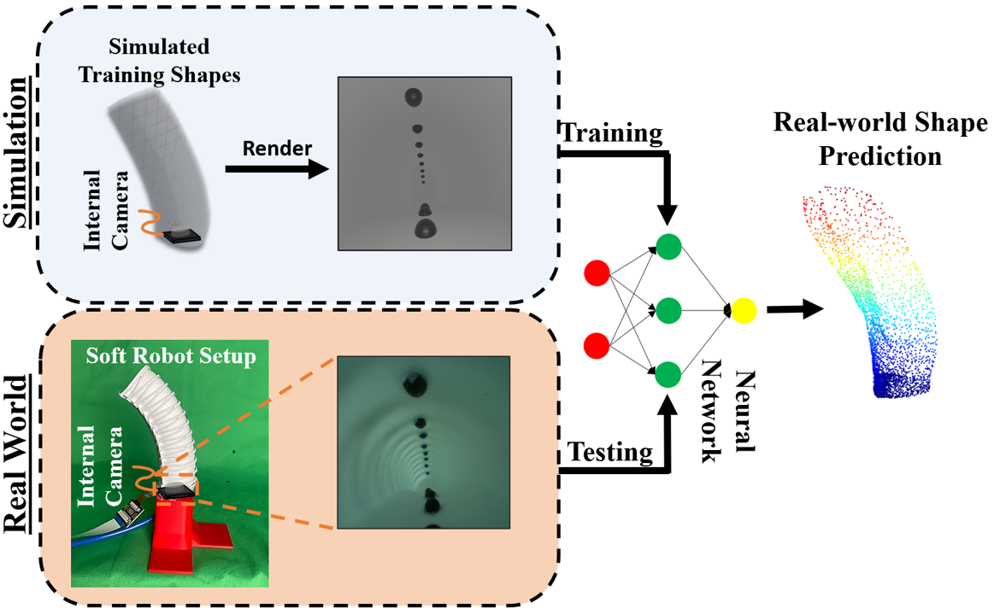

<div align="center">   
  
# Toward Zero-Shot Sim-to-Real Transfer Learning for Pneumatic Soft Robot 3D Proprioceptive Sensing
</div>


# Abstract
Pneumatic soft robots present many advantages in
manipulation tasks. Notably, their inherent compliance makes
them safe and reliable in unstructured and fragile environ-
ments. However, full body shape sensing for pneumatic soft
robots is a difficult challenge because of their high degrees
of freedom and complex deformation behaviors. Vision-based
proprioception sensing methods relying on embedded cameras
and deep learning provide a good solution to proprioception
sensing by extracting the full-body shape information from the
high-dimensional sensing data. But the current training data
collection process makes it difficult for many applications. To
address this challenge, we propose and demonstrate a robust
sim-to-real pipeline that allows the collection of the soft robot’s
shape information in high-fidelity point cloud representation.
The model trained on simulated data was evaluated with
real internal camera images. The results show that the model
performed with averaged Chamfer distance of 8.85 mm and
tip position error of 10.12 mm even with external perturbation
for a pneumatic soft robot with a length of 100.0 mm. We also
demonstrated the sim-to-real pipeline’s potential for exploring
different configurations of visual patterns to improve vision-
based reconstruction results. The code and dataset are available https://github.com/DeepSoRo/DeepSoRoSim2Real.


# Method

|  | 
|:--:| 
| ***Figure 1. Overall framework**. The proposed pipeline of sim-to-real transfer learning for vision-based soft robot. We generated simulation-based point cloud and corresponding internal camera views to train our neural network model. Then, we show that the trained model transfers zero-shot to the real world by testing with real-world images..* |

# Usage
## Training
scripts/train_example.sh
```
python src/train.py \
--note 'Pattern_1' \
--device 0 \
--epoch 100 \
--batch_size 50 \
--lr_init 1e-4 \
--weight_decay 1e-6 \
--train_dataset <training_dataset.npz> \
--valid_dataset <validation_dataset.npz> \

```

## Inferencing
scripts/inference_example.sh
```
python src/inference.py \
--dataset <validation_dataset.npz> \
--checkpoint <model_checkpoint.pth> \
--filename <output_filename.gif>

```


# Dataset 


The full dataset presented in this paper is available for download in the following link [13.4 GB .zip]: https://cmu.box.com/s/ehilym4yhr6dm2zit6koslqpm87084bp
```sh
<dataset_path>
./ex[1-35] #experiment names
./ex[1-35]/rawimg_dense # .png proprioceptive raw images for Pattern 2
./ex[1-35]/rawimg_vert # .png proprioceptive raw images for Pattern 4
./ex[1-35]/bin_dense # .png proprioceptive binary images for Pattern 2
./ex[1-35]/bin_vert # .png proprioceptive binary images for Pattern 4
./ex[1-35]/outermesh_dense # .obj watertight surface mesh of the robot shape reset to the position of the camera for Pattern 2
./ex[1-35]/outermesh_vert # .obj watertight surface mesh of the robot shape reset to the position of the camera for Pattern 4
```
# Bibtex
If this work is helpful for your research, please cite the following BibTeX entry.

```

```

# Acknowledgement
